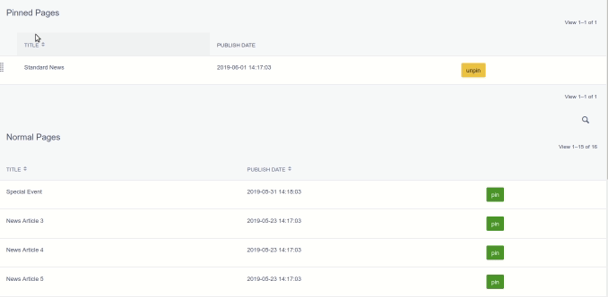
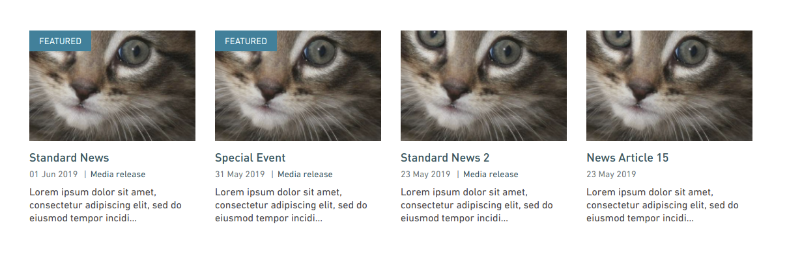

# Superglue

Connect interesting pages to your landing page, with minimal effort!

## Installation

```
$ composer require silverstripe/superglue
```

## Docs

You can find an [overview on the SilverStripe blog](http://www.silverstripe.org/blog/superglue-your-pages)!

## Example Usage

An example usage for Superglue would be if you have a list of featured news & events. By default, you may want to display the latest 4 items. However, if there's a special news aritcle or event you may want to pin this, giving it a higher priority than the standard news articles and then display the rest of the list afterwards. Here's an example of what that looks like with Superglue.

Select your pinned items in the CMS:



The pinned items appear first, followed by a default list of non-pinned items.




## Tests

Working on the tests. So far they've been rolled into the first site this was used on, and we're in the process of extracting them...

## Versioning

This library follows [Semver](http://semver.org). According to Semver, you will be able to upgrade to any minor or patch version of this library without any breaking changes to the public API. Semver also requires that we clearly define the public API for this library.

All methods, with `public` visibility, are part of the public API. All other methods are not part of the public API. Where possible, we'll try to keep `protected` methods backwards-compatible in minor/patch versions, but if you're overriding methods then please test your work before upgrading.

## Reporting Issues

Please [create an issue](http://github.com/silverstripe/silverstripe-superglue/issues) for any bugs you've found, or features you're missing.
